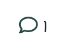
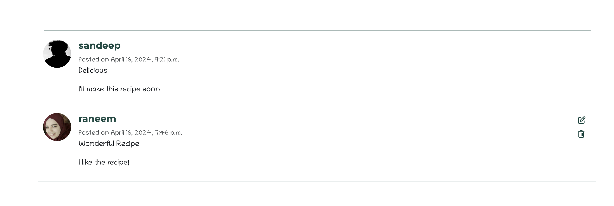

# Zaitouna


## Introduction

Zaitouna is a recipe Website and the name "Zaitouna" means olive in Arabic, symbolizing health and flavor, invoking the essence of olive and the rich flavors it represents in Arabic cuisine. Zaitouna has been developed as part of the Code Institute's Full-Stack Developer course as my 4th project - focusing on Django and Bootstrap frameworks, Database manipulation and CRUD functionality. 


View the live site here : [Zaitouna](https://zaitouna-rano-19b1e34433ec.herokuapp.com/)  
  
For Admin access with relevant sign-in information: [Zaitouna Admin](https://zaitouna-rano-19b1e34433ec.herokuapp.com/admin/)  

<hr>

## Table of Contents

- [Zaitouna](#Zaitouna)
  - [Introduction](#introduction)
  - [Table of Contents](#table-of-contents)
  - [Overview](#overview)
- [UX - User Experience](#ux---user-experience)
  - [Wireframes](#Wireframes)
  - [Site Structure](#site-structure)
  - [Design Inspiration](#design-inspiration)
    - [Colour Scheme](#colour-scheme)
    - [Font](#font)
- [Project Planning](#project-planning)
  - [Strategy Plane](#strategy-plane)
    - [Site Goals](#site-goals)
  - [Agile Methodologies - Project Management](#agile-methodologies---project-management)
    - [MoSCoW Prioritization](#moscow-prioritization)
    - [Sprints](#sprints)
  - [User Stories](#user-stories) 
  - [Database Schema](database-schema)
  - [Scope Plane](#scope-plane)
- [Features](#features)
  - [Existing Features](#existing-features)
  - [Future Features](#future-features)
- [Technologies Used](#technologies--languages-used)
  - [Languages](#languages)
  - [Frameworks](#frameworks)
  - [Software](#software)
  - [Libraries](#libraries)
- [Testing](#testing)
  - [User Story](#user-story-tests)
  - [Validator Tests](#validator-tests)
  - [Input Validation](#input-validation-tests)
  - [Automated Test](#automated-testing)
  - [Responsive Tests](#responsive-tests)
  - [Lighthouse Test](#lighthouse-tests)
  - [Wave Accessibility Test](#wave-accessibility-tests)
- [Deployment](#deployment)
  - [Connecting to GitHub](#connecting-to-github)
  - [Django Project Setup](#django-project-setup)
  - [Cloudinary API](#cloudinary-api)
  - [Elephant SQL](#elephant-sql)
  - [Heroku deployment](#heroku-deployment)
  - [Clone project](#clone-project)
  - [Fork Project](#fork-project)
- [Credits](#credits)
  - [Code](#code)
  - [Media](#media)
    - [Website Recipes](#website-recipes)
  - [Acknowledgements](#acknowledgements)


## Overview

Zaitouna is a recipe Website that represents Arabic cuisine. Users are invited to:

- Join the Zaitouna Website
- Create their own profiles
- Update their Profiles 
- Interact with Website recipes
- Create and manage their recipes
- Share their thoughts as Comments 
- Save the recipe for later reach as a bookmark
- Share the recipe over social media accounts

Zaitouna is accessible via all browsers with full responsiveness on different screen sizes. The objective of the project is to develop a comprehensive recipe website where users can discover, save, and share recipes. The website aims to provide a user-friendly platform for individuals interested in cooking to find a wide range of recipes and cooking difficulty levels. Additionally, the website will facilitate interaction and engagement among users through features such as commenting, rating, and sharing recipes.


# UX - User Experience


## Wireframes

Wireframes were created using [Balsamiq](https://balsamiq.com/) to plan content flow and styling for Zaitouna. Some differences can be seen between the original wireframes and the finished product, and this is due to design choices made during the creative process.

### Home Page 


### Recipe Details


### Search Recipes


### Add Recipes


## Site Structure 

The website is organized into several main sections to provide users with a seamless browsing experience. Upon landing on the homepage, users are greeted with a selection of Weekly recipes and featured recipes, showcasing the newest popular dishes. They can also explore various recipe meal types, including appetizers, main courses, desserts, and beverages, to find recipes that suit their preferences. A search bar is available for users to quickly find specific recipes or ingredients.

Registered users have access to their own user profile, where they can upload a profile picture, write a bio, and view the recipes they have added to the website. Each recipe has its own detailed page, displaying the title, ingredients, instructions, reviews, ratings, and options to share the recipe with others.

For new users or those who need to log in, the website provides authentication pages for logging in and signing up. In case users encounter a page that does not exist or encounter a broken link, a custom 404 error page is available to guide them back to the main site.

Finally, the footer of the website contains essential info about the website, and links to the website's social media profiles, allowing users to stay connected and informed about the latest updates and news related to Zaitouna Recipes.


## Design Inspiration

The design inspiration behind the Zaitouna website is rooted in creating a visually appealing and comfortable user experience. With a focus on olives, symbolized by the name "Zaitouna" which means olives in Arabic, the design aims to evoke a sense of freshness, tranquility, and authenticity.

The choice of a white background contributes to a clean and minimalist aesthetic, providing a canvas for the vibrant green color scheme to shine. Green, reminiscent of olive leaves, is prominently featured throughout the website to reinforce the connection to nature and the Mediterranean region.

The logo, with its depiction of olive leaves, serves as a visual representation of the website's name and theme. By incorporating elements from nature, the logo reinforces the concept of freshness and natural ingredients.

<br>


### Colour Scheme

Colors have been selected carefully in a way that reflects the essence of olives.
**Primary Color (Header/Footer): #184B44**
This deep green shade represents the rich color of olives, tying in with the Mediterranean theme of the website.

**Accent Color: #FAD02E**
Our warm yellow accent color symbolizes the transformation of olives into delicious meals, mirroring the process from raw material to culinary delight.

**Secondary Accent Colors:**
#7DCE82: A refreshing mint green shade, perfect for buttons and interactive elements.

**Neutral Color**
#FFFFFF: Pure white is used to ensure readability and contrast against the other dark elements.


  

### Font

Using [Google Fonts](https://fonts.google.com/), two fonts was opted: 

**Chilanka:**

Chilanka font was opted for the text throughout the website. Its handwritten style evokes a sense of familiarity and nostalgia, reminiscent of jotting down recipes on paper. This choice aims to create a personal connection with users, inviting them to share their culinary creations as if they were writing them by hand.

**Montserrat:**

Montserrat is used for titles and headings, adding a touch of elegance and modernity to the website's design. Its clean and geometric appearance complements the handwritten style of Chilanka, creating a balanced and harmonious typographic palette.

In development, 'Chilanka' was identified by variable ``` --main-font```, whilst 'Montserrat' was set as ``` --title``` within the CSS file. Similar to my setup for the project's colors, using variables helped to speed up the front-end process.

  
  


# Project Planning  
 
## Strategy Plane

The focus of the website is on creating a user-centric platform that celebrates the rich culinary heritage of Oriental cuisine. Our key objectives include:

1- User Engagement: Prioritizing features that enhance user interaction and encourage community participation, such as recipe sharing, commenting, and rating.

2- Authenticity: Curating a diverse collection of authentic recipes from the Middle East, Asia, and beyond, ensuring a genuine culinary experience for our users.

3- Visual Identity: Establishing a distinctive visual identity through carefully selected colors, fonts, and imagery that reflect the essence of olives and Mediterranean cuisine.

4- Accessibility: Designing a user-friendly interface that is accessible to all users, regardless of their device or abilities, to ensure an inclusive experience for everyone.

5- Scalability: Building a robust and scalable platform capable of accommodating future growth and expansion, including the addition of new features and functionalities.

### Site Goals

1- Discover Recipes: Users want to find new and interesting recipes to try out.

2- Save and Organize Recipes: Users want to save their favorite recipes and organize them for easy access.

3- Interact with Community: Users want to engage with other users by sharing their experiences, leaving comments, and rating recipes.

4- Contribute Content: Users want to contribute their own recipes to the website and share them with others.

5- Learn and Improve Cooking Skills: Users want to learn new cooking techniques, discover tips, and improve their culinary skills through the content provided on the website.

## Agile Methodologies - Project Management

Zaitouna is my first project following Agile planning methods. I used my [Github Projects Board](https://github.com/users/raneem-yad/projects/4) to plan and document all of my work.

### MoSCoW Prioritization

I chose to follow the MoSCoW Prioritization method for Zaitouna, identifying and labeling:

- **Must Haves**: the 'required', critical components of the project. Completing my 'Must Haves' helped me to reach the MVP (Minimum Viable Product) for this project early, allowing me to develop the project further than originally planned.
  
- **Should Haves**: the components that are valuable to the project but not absolutely 'vital' at the MVP stage. The 'Must Haves' must receive priority over the 'Should Haves'.
- **Could Haves**: these are the features that are a 'bonus' to the project, it would be nice to have them in this phase, but only if the most important issues have been completed first and time allows.
- **Won't Haves**: the features or components that either no longer fit the project's brief or are of very low priority for this release. 

### Sprints

With a tight deadline of 10 days to complete the project, I organized my work into four sprints. This rapid sprint approach allowed me to break down the project into manageable chunks and maintain focus on delivering key features and functionality.

During each sprint, I divided my tasks into two main categories: Developer (Dev) Tasks and User Stories. These tasks were converted into issues and meticulously labeled on my project board. Every issue was tagged as either a user story or a bug, providing clear reference points for development tasks.

Each user story was carefully crafted to include detailed information about its theme, epic, acceptance criteria, and associated tasks. This structured approach helped me stay organized and prioritize my work effectively.

Furthermore, breaking down user stories into individual tasks enabled me to track progress and easily identify the next steps in the development process. This agile methodology proved invaluable in maximizing productivity and ensuring the timely completion of project milestones.


| Sprint No. | Sprint Content | Start/Finish Dates |
|------------|----------------|--------------------|
| #1 | Setup/Recipe Features | 08/04/24  -> 11/04/24  |
| #2 | Comments/ Sharing | 11/04/24  -> 13/04/24  |
| #3 | Rating/ Profiles | 13/04/24 -> 15/04/24 |
| #4 | Testing/Documentation | 15/04/24 -> 17/04/24 |


## User Stories

User stories and features recorded and managed on [GitHub Projects](<https://github.com/users/raneem-yad/projects/4>)


### Database Schema

Database schemas were drawn up using [App Diagrams.net](https://app.diagrams.net/). The schemas were used to plan the database models and fields. It also helped in displaying the relationships between the models and how they interact. Zaitouna consists of five models - Recipe, Comment, User, Meal-type and Rating.
There were some changes between the designed database and the implemented one due to more clarity like Category Table was changed to Meal-Type


## Scope Plane

In the scope plane of the Zaitouna Recipes project, the boundaries and features were defined that will be included in the website. The scope encompasses the key functionalities and components that will be developed to meet the project objectives.

The scope has been defined to prioritize essential features that align with the project objectives and timeline. By focusing on core functionalities such as user authentication, recipe management, and profile enhancement, a solid foundation was ensured for the website while keeping development efforts manageable within the specified timeframe.


Features Included:

1. User Authentication: Allow users to create accounts, log in, and manage their profiles.
2. Recipe Management: Enable users to add, edit, and delete their recipes.
3. Recipe Browsing: Provide users with the ability to browse and search for recipes based on meal type and keywords.
4. Recipe Interaction: Allow users to  rate, review(comment), and share recipes with others.
5. Profile Enhancement: Allow users to personalize their profiles by uploading profile pictures and adding a bio.
6. Home Page Features: Showcase featured recipes(weekly recipes) and provide quick access to the latest recipes.
7. Layout and Design: Responsive website for users of mobile, tablet and desktop devices

# Features

## Existing Features

### Homepage

The homepage is the first page of the site that a user will see when they navigate to the [Zaitouna URL](https://zaitouna-rano-19b1e34433ec.herokuapp.com/). It's designed to be eye-catching to users and to quickly summarise the intention of the site. It is also a central location for all users to view recipes. 


#### Navigation

Site navigation is present at all times on every page of the site in the form of footer and header nav bars. These navigational elements change depending on whether a user is logged in or not. Non logged in users only have access to the home page, recipe detail pages, view all recipe page and the login and signup page. These elements are also fully responsive and the header collapses to become a mobile menu on small screen sizes. The header nav features the site logo which is also a link back to the home page. It also features a post a recipe button which is distinctly different from the other nav menu items. This is to draw the user's eye and encourage them to sign up so that they can use this feature. All nav menu items feature a scale and underline hover effect. Navigation items are active on the current page and the  white color as indicator as a visual aid to show the user where they are.


#### Hero

The homepage hero section is the large eye-catching section that is just beneath the navigation bar. The hero is only displayed on the homepage as Weekly Recipe. It is used to catch the users attention, and to clearly showcase the general topic of the site. It features a large image for the recipe week and with title and description about the recipe and call to action button to help user see the full image details.


#### Latest Recipes List

The latest recipe list is a dynamic list of the latest recipes that have been uploaded to the site. When a new recipe is published it will appear at the top of the list. Each recipe is displayed as a card, and each card has an image, , title, author profile image  and author name, posted date , tags of difficulty , meal type, serves and cooking time, small description and in the card footer a rating of 5 stars and a button to the full recipe page. The list displays a maximum of six cards to avoid clutter. At the end of the section, there is also a buttons to go to the next recipe page. This section is fully responsive, and cards stack on top of each other on smaller screens. 


#### Footer

The Zaitouna footer is present on every page of the site. It features the website logo, elegantly designed with olive leaves to symbolize the essence of Zaitouna. beside the logo, users can find a concise website description, capturing the essence of Zaitouna Recipes as a platform celebrating the rich culinary heritage of Oriental cuisine. Social media icon links feature coloured hover effects. 


### Authorization

#### Sign Up

A user can navigate to the sign up page via the site navigation bars if they are not logged in. The Zaitouna sign up page is a template from the [Django Allauth Package](https://django-allauth.readthedocs.io/en/latest/installation.html). Allauth provides the basic functionality for the user authorization used in Zaitouna. However, the basic allauth templates have been heavily customized and styled to match the site design. The sign up page features a title and a sign up form with user input fields. Once a user submits the form correctly they are redirected back to the homepage as a logged-in user.


#### Log In

A user can navigate to the log in page via the site navigation bars if they are not already logged in. The styling of the log in page is very similar to the rest of the user authorization pages. The color scheme and background image are consistent, but the form and page heading are different. Once the log in form is submitted correctly the user is redirected to the homepage as a logged-in user.


#### Log Out

A user can navigate to the log-out page via the site navigation bars if they are logged in. They are prompted on this page to confirm they wish to log out. Upon confirmation, the user is logged out and redirected to the homepage. The styling is consistent with the other authorization pages for coherence. 


### Full Recipe Details

The full recipe details page is a template used to display the full information of a recipe. Each published recipe has a recipe details page. Theses pages are available for all users to view, including non-logged-in users. The main purpose of the page is to display the full recipe instructions and ingredients. Users will generally navigate to a full recipe page by clicking the button on the recipe card either on the home page or the all recipes page. As the user has now shown a specific interest in the recipe, all the information about the recipe is displayed here. 


#### Recipe Details

The first section of the recipe page features the recipe image. When there is more than one image, a gallery of images is displayed underneath the main image. Basic recipe details and information is displayed in the top section, such as cooking, prep time and allergens. There is also an icon on the image which allows the user to like the recipe. In the middle section there are two columns of text displaying the recipe ingredients and method. These fields are both summernote fields so they accept fully formatted and styled user text. Each section on the recipe details page is separated by a divider to clearly illustrate the different segments. 


#### Bookmark / Unbookmark Recipe

The bookmark feature on the Zaitouna Recipes website allows users to save recipes for easy access and future reference. When users find a recipe they want to save, they can simply click on the bookmark icon associated with that recipe. This action adds the recipe to their list of bookmarked recipes, which they can access later from their profile page.

Conversely, users can also unbookmark a recipe if they no longer wish to save it. By clicking on the bookmark icon again, the recipe is removed from their list of bookmarked recipes.

This bookmarking functionality enhances the user experience by providing a convenient way for users to keep track of their favorite recipes and quickly access them whenever they need. Whether they're planning their next meal or revisiting a beloved dish, the bookmark feature ensures that users can easily find the recipes that matter most to them.


#### Share Recipe

The share feature on the Zaitouna Recipes website allows users to easily share their favorite recipes with friends, family, and followers on social media platforms such as Facebook and Twitter, as well as through email.

When users come across a recipe they want to share, they can simply click on the share icon associated with that recipe. This action opens a popup or modal window with options to share the recipe on various social media platforms, including Facebook and Twitter. Users can also choose to share the recipe via email by entering the recipient's email address and adding a personalized message.

By leveraging the share feature, users can spread the joy of cooking and inspire others with delicious recipes from Zaitouna Recipes. Whether they're sharing a newfound favorite or recommending a dish to a friend, the share feature facilitates seamless sharing and engagement across social networks and personal contacts.


#### Rating Recipe

The rating feature on the Zaitouna Recipes website allows users to rate recipes based on their experience, with a scale of five stars representing the overall quality and appeal of the recipe. Users can provide their rating by clicking on the appropriate number of stars, ranging from one star for the lowest rating to five stars for the highest rating.

In addition to individual ratings, the website also displays the average rating for each recipe, calculated based on the collective ratings provided by all users. beside the average rate there is a number of people who have rated the recipe, providing users with an indication of the recipe's popularity and the reliability of the average rating. This information helps users make informed decisions about which recipes to try and enables them to gauge the general consensus among other users.

By incorporating the rating feature alongside with the number of ratings, Zaitouna Recipes empowers users to share their feedback, discover top-rated recipes, and contribute to a vibrant and engaged community of culinary enthusiasts.


#### Recipe Comments

At the top of each recipe there is a comment icon with the count of comments on the recipe.

At the bottom of each recipe details page there is a comments section for users to post comments. Logged in users can use the comment form to post a comment to that particular recipe. Comments need to be approved by an admin before they appear on the site. Comments are listed in the admin area as unapproved, and there is an action to approve comments in the admin actions menu. When comments are approved by the admin they immediately go live on the site and appear beneath the recipe. Comments are listed from the most recent at the top to the oldest at the bottom. The username of the comment author is displayed as well as the date and  profile photo and the body of the comment. 






#### Comment Form

The recipe comment form is what the user uses to post a comment on a recipe. This comment form is only visible to logged in users, as a username is required for successful submission. The comment form comprises of one text body field for the comment and a submit button. The author is assigned automatically as well as the created-on date.


#### Post Comment Notification

Upon the successful submission of the comment form, the page will refresh and a notification will appear at the top of the page. This notification advises the user that their comment has been successfully posted. The notification can be removed from view by clicking the x icon The form is also hidden from view in the comment section, and this is instead replaced by a short paragraph of text thanking the user for posting a comment. The text also advises the user that the comment will be visible after it has been approved. 


### Search Recipes

The search functionality on the Zaitouna Recipes website allows users to easily find recipes by entering keywords related to discriptions or recipe names. Users can simply type their desired keywords into the search bar and press 'Search' to view relevant recipes matching their search criteria.

In addition to keyword search, the website also provides the option to filter recipes by meal type, allowing users to narrow down their search results based on specific categories such as breakfast, lunch, dinner, appetizers, desserts, and more. Users can select their desired meal type from a dropdown menu or a list of predefined categories to refine their search results further.

By combining keyword search with meal type filtering, Zaitouna Recipes offers users a comprehensive and customizable search experience, enabling them to find exactly what they're looking for quickly and efficiently. Whether users are searching for a specific recipe or exploring new meal ideas, the search functionality provides a convenient and user-friendly way to discover delicious recipes tailored to their preferences.


#### Profiles

The profile page on the Zaitouna Recipes website serves as a personalized hub for each user, allowing them to manage their account, showcase their contributions, and connect with other members of the community. Here's an overview of the key features and components of the profile page:

1- Profile Picture and Username: The top section of the profile page displays the user's profile picture, providing a visual representation of their identity on the website. Next to the profile picture, the user's username is prominently displayed, allowing other users to easily identify and connect with them.

2- Bio: Besides the profile picture and username, users have the option to write a bio to share more about themselves with the community. This section allows users to express their interests, culinary preferences, and any other information they wish to share.

3- User Contributions: The profile page showcases the user's contributions to the website, including the recipes they have added. Users can browse through their recipes and see how they have contributed to the community.

4- Edit Profile: Users can edit their profile information directly from the profile page. This includes updating their profile picture and editing their bio.

5- Bookmarked Recipes: This page is also displaying the recipes they have bookmarked for future reference. This allows users to easily access their favorite recipes from their profile page.


#### Delete / Edit Recipe

A user can delete their recipe easily from the My Recipe page. If a user clicks the delete button on a recipe card the card content is hidden and a delete confirmation is displayed seeking confirmation from the user for recipe deletion. The user is also warned that the process cannot be undone. The user then has the option to cancel the delete by clicking the cancel button or to confirm recipe deletion by clicking the delete button. The delete button is purposefully coloured red for warning. If the user clicks the cancel button the card content is returned to normal. If the user clicks the delete button the recipe is deleted from the database and the page is refreshed showing the recipe removed from the list.


### Post A Recipe

The post a recipe page template is a page which features a recipe form to enable users to submit a recipe to the Zaitouna site. The page isn't viewable by unauthenticated users so they have to login first. The page features similar styling to the rest of the site for consistency, and the header and footer nav menus are present for easy user navigation. 


### 404 Page

The 404 page is triggered when a user navigates to a site URL which doesn't exist. This could be because of a number of reasons, including a faulty link or an expired URL. Most users will not see this page, but it is there as a backup for users who encounter these rare errors. The purpose of the 404 page is to notify the user that there has been an error, and the page that they have tried to access cannot be found. The Zaitouna 404 page provides a button link to the homepage for the user to easily navigate back home.


## Future Features

I believe the Zaitouna site has a lot of potential for expansion in the future. The basic functionality is there for the MVP, but there are many features I would like to add in the future.


### User Change Password

Adding this option for users who forget or want to change their password. Currently, a user has no way to retrieve their password/profile if they forget their login details. This could result in the user losing access to their profile and recipes. This is a big problem and could lead to users abandoning the site in the future. Hence this feature is a priority moving forward.


### Sign Up Email Confirmation

Another future feature I would like to implement relating to authorization is a user sign-up email confirmation. I would like a user sign-up form submission to trigger an automated email into the user inbox prompting them to confirm their email address. This would help to prevent spam profiles. Users who sign up but don't confirm their email can still view the site but have limited access to site functionality such as posting and commenting.


### Advanced Search Recipes

Expand the search functionality to include more advanced filters, such as dietary preferences (e.g., vegetarian, vegan, gluten-free), cooking time, difficulty level, and ingredient exclusions. This would allow users to find recipes that better match their specific needs and preferences.

### Interactive Cooking Guides

Introduce interactive cooking guides or step-by-step tutorials for select recipes, complete with instructional videos, tips, and techniques to help users master the cooking process and achieve professional results.

### Meal Planning Tools

Integrate meal planning tools that enable users to plan their meals for the week, generate shopping lists based on selected recipes, and track their cooking progress.

### Localization Support

Offer support for multiple languages and regional cuisines to cater to a diverse audience of users from different cultural backgrounds and geographic regions.

# Technologies Used

## Languages

* [HTML5](https://developer.mozilla.org/en-US/docs/Web/HTML) - Provides the basic content and structure for the site.
* [CSS3](https://developer.mozilla.org/en-US/docs/Web/CSS) - Provides the styling for the site.
* [Python](https://www.python.org/) - Provides the functionality for the site.
* [JavaScript](https://www.javascript.com/) - Provides interactivity and front-end functionality for the site.

## Frameworks

* [Bootstrap](https://getbootstrap.com/) - A front-end framework for rapidly building websites.
* [Django](https://www.djangoproject.com/) - A high-level Python web framework.


## Software

* [Balsamiq](https://balsamiq.com/) - An online cloud-based software used for creating the site wireframes.
* [GitHub](https://github.com/) - An internet hosting service used for version control. Used to host the Zaitouna repository and for the project board used for project management and user stories.
* [Pycharm](https://www.jetbrains.com/pycharm/) - The Python IDE for data science and web development.
* [Heroku](https://dashboard.heroku.com/) - A cloud platform used to host the Zaitouna full-stack application.
* [CI Database Maker](https://dbs.ci-dbs.net/manage/rTakZeqXDXBar2aq/) - A free PostgreSQL database system supported by code institute used for the application database.
* [Cloudinary](https://cloudinary.com/?&utm_campaign=1329&utm_content=instapagelogocta-selfservetest) - A cloud-based video and image management platform used to store the site images.
* [Slack](https://slack.com/intl/en-gb/) - An online instant messaging program used for site feedback and guidance from the [Code Institute](https://codeinstitute.net/) community.
* [App Diagrams](https://app.diagrams.net/) - An online diagram software used for the database schemas.
* [Google Chrome Dev Tools](https://developer.chrome.com/docs/devtools/) - A set of web developer tools built directly into the chrome browser. Used for responsiveness tests and further testing.
* [Google Fonts](https://fonts.google.com/) - A web based font service by Google used to supply the site typography.
* [Lighthouse](https://developer.chrome.com/docs/lighthouse/overview/) - An open source automated testing tool used for site tests.
* [Responsive Design Checker](https://responsivedesignchecker.com/) - An online testing tool used for responsive site testing.
* [Am I Responsive](https://ui.dev/amiresponsive) - An online testing tool used for responsive site testing.
* [Wave Web Accessibility Evaluation Tool](https://wave.webaim.org/) - An online suite of evaluation tools use to test the site for accessibility.
* [Canva](https://canva.com/) - Creating the Logo


## Libraries

This is a list of the Python / Django libraries used in this project.

- Django AllAuth 
- Django Crispy Forms 
- Crispy Bootstrap5 
- Django Resized 
- Django RichTextField 
- Python Slugify 
- Pillow 
  
Further information is available in the [requirements.txt file](requirements.txt)

# Testing

The Zaitouna site has been tested rigorously throughout the development process. This section will provide documentation on the tests carried out.

## User Story Tests

### 1. **As a** User,**I want** to be able to create a new account with my email address and password, **So that** I can access the website's features.


#### Acceptance Criteria:
1. The user should be able to navigate to the sign-up page from the homepage.
2. The sign-up page should contain input fields for the user's email address and password.
3. The user should receive a confirmation message upon successful sign-up.

#### Tasks:
- [x] Implement the sign-up page UI.
- [x] Set up the backend to handle user registration.
- [x] Validate user input for email address and password.
- [x] Show a confirmation message to the user upon successful registration.
- [x] Test the sign-up process to ensure functionality and user experience.

### 2. **As a** User,**I want** to be able to log into my account securely using my email address and password,  **So that** I can access the website's features.

#### Acceptance Criteria:
1. The user should be able to navigate to the login page from the homepage.
2. The login page should contain input fields for the user's email address and password.
3. The user should receive an error message if they enter incorrect login credentials.
4. Upon successful login, the user should be redirected to the HomePage.

#### Tasks:
- [x] Implement the login page UI.
- [x] Set up the backend to handle user authentication.
- [x] Validate user input for email address and password.
- [x] Provide appropriate error messages for invalid login attempts.
- [x] Redirect the user to HomePage upon successful login.
- [x] Test the login process to ensure functionality and security.


### 3. **As a** User, **I want** to see my recipes in my profile, **So that** I can access them quickly and easily.

#### Acceptance Criteria:

1. The user should have a "My Recipes" section or tab in their profile page.
2. The "My Recipes" section should display a list of recipes that the user has added or saved.
3. Each recipe in the "My Recipes" section should include basic information such as the recipe title, image, and a brief description.
4. The user should be able to click on a recipe to view its full details.
5. If the user has not added or saved any recipes yet, the "My Recipes" section should display a message indicating that there are no recipes to show.


#### Tasks:
- [x] Add a "My Recipes" section or tab to the user's profile page UI.
- [x] Implement backend functionality to fetch and display the user's recipes.
- [x] Design the layout for displaying recipe information within the "My Recipes" section.
- [x] Ensure that clicking on a recipe redirects the user to the recipe's detailed view.
- [x] Handle cases where the user has no saved or added recipes.
- [x] Test the "My Recipes" section to ensure it accurately displays the user's recipes and provides a smooth user experience.


### 4. **As a** User, **I want** to be able to browse recipes and view detailed information about each recipe, **So that** I can discover new recipes and decide which ones to try.


#### Acceptance Criteria:
1. The website should have a dedicated page or section for browsing recipes.
2. Each recipe should be displayed with basic information such as the recipe title, image, and a brief description.
3. Users should be able to click on a recipe to view its detailed information.
4. The detailed view of a recipe should include ingredients, instructions, cooking time, difficulty level, and any other relevant details.
5. Users should have the option to save or bookmark recipes for later access.
6. The browsing experience should be user-friendly and intuitive, allowing users to easily navigate between different recipes.

#### Tasks:
- [x] Create a dedicated page or section for browsing recipes.
- [x] Design the layout for displaying multiple recipes, including titles, images, and descriptions.
- [x] Implement functionality to fetch and display recipes from a database or external source.
- [x] Design the layout for the detailed view of a recipe, including all relevant information.
- [x] Implement functionality to save or bookmark recipes for later access.
- [x]  Test the recipe browsing and detailed view functionalities to ensure they meet user expectations and provide a seamless experience.

### 5. **As a** User,**I want** to be able to search for specific recipes based on keywords or filters, **So that** I can quickly find recipes that match my requirements.

#### Acceptance Criteria:
1. The website should have a search bar prominently displayed on the homepage or recipe browsing page.
2. Users should be able to enter keywords or phrases into the search bar to find recipes related to their query.
3. The search functionality should support filtering recipes based on criteria such as ingredients, cuisine, dietary restrictions, cooking time, and difficulty level.
4. Users should be able to refine their search results using multiple filters simultaneously.
5. Search results should be displayed in a clear and organized manner, showing relevant information such as recipe titles, images, and descriptions.
6. Users should be able to click on a search result to view detailed information about the corresponding recipe.


#### Tasks:

- [x] Add a search bar to the homepage or recipe browsing page UI.
- [x] Implement backend functionality to handle search queries and filtering.
- [x] Design the layout for displaying search results, including relevant recipe information.
- [x] Implement filtering options for refining search results based on various criteria.
- [x] Test the search functionality with different search queries and filters to ensure accuracy and efficiency.


### 6. **As a** User ,**I want** to save or bookmark recipes, **So that** I can easily access them later when needed.

#### Acceptance Criteria:

1. Users should have the option to save or bookmark recipes from the recipe details page.
2. There should be a visible and intuitive button or icon for saving recipes.
3. Upon clicking the save or bookmark button, the recipe should be added to the user's saved recipe collection.
4. Users should be able to access their saved recipes from their profile page or a dedicated "Saved Recipes" section.
5. The saved recipes should be displayed with basic information such as the recipe title, image, and a brief description.
6. Users should be able to remove recipes from their saved collection if they no longer wish to keep them.

#### Tasks:
- [x] Add a save or bookmark button to the recipe details page UI.
- [x] Implement backend functionality to handle saving and retrieving saved recipes.
- [x] Design the layout for displaying saved recipes on the user's profile page or a dedicated section.
- [x] Implement functionality to add and remove recipes from the user's saved collection.
- [x] Test the save and retrieve functionalities to ensure saved recipes are stored and displayed accurately.
- [x] Ensure that saved recipes are accessible and manageable for users across different devices and sessions.

### 7. **As a** user,**I want** to be able to rate recipes that I've tried and see ratings from other users, **So that** can make informed decisions about which recipes to try.

#### Acceptance Criteria:
1. Users should have the option to rate recipes after trying them from the recipe details page.
2. The rating system should use a scale (e.g., stars) to allow users to indicate their satisfaction with the recipe.
3. The average rating for each recipe should be displayed prominently on the recipe details page.
4. Users should be able to see individual ratings and reviews from other users on the recipe details page.
5. Ratings and reviews should be displayed in a clear and organized manner, showing the user's name, rating, and review text.
6. Users should be able to sort recipes based on ratings to find the highest-rated recipes easily.

#### Tasks:
- [x] Add a rating system (e.g., stars) to the recipe details page UI.
- [x] Implement backend functionality to handle user ratings and reviews for recipes.
- [x] Design the layout for displaying average ratings and individual ratings/reviews on the recipe details page.
- [x] Implement functionality to calculate and display the average rating for each recipe.
- [x] Test the rating and review functionalities to ensure accuracy and reliability.

### 8. **As a** user ,**I want** to be able to review recipes I've tried by leaving comments and see reviews from other users, **So that** I can share my experiences and provide feedback.

#### Acceptance Criteria:
1. Users should have the option to leave comments or reviews after trying a recipe from the recipe details page.
2. The comment section should allow users to write and submit their feedback about the recipe.
3. Comments left by users should be displayed below the recipe details, showing the user's name, timestamp, and comment text.
4. Users should be able to see all comments and reviews from other users on the recipe details page.
5. The comment section should be interactive, allowing users to like, reply to, or report comments if necessary.
6. Comments and reviews should be displayed in a clear and organized manner, facilitating easy reading and navigation.


#### Tasks:
- [x]  Add a comment section to the recipe details page UI.
- [x] Implement backend functionality to handle user comments and reviews for recipes.
- [x] Design the layout for displaying user comments and reviews, including user names, timestamps, and comment text.
- [x] Implement functionality to submit, display, and manage user comments.
- [x] Test the comment and review functionalities to ensure usability and reliability.

### 9. **As a** User, **I want** to be able to share recipes with friends and family through social media or email, **So that**  I can easily recommend delicious recipes and spread culinary inspiration.

#### Acceptance Criteria:
1. Users should have the option to share recipes via social media platforms (e.g., Facebook, Twitter, Pinterest) or email.
2. The sharing options should be easily accessible from the recipe details page.
3. Clicking on a social media sharing button should open a new window or dialog box with pre-filled information (e.g., recipe title, image, and link).
4. Users should have the option to customize the shared message before posting it on social media or sending it via email.
5. The shared content should include a clickable link that directs recipients back to the recipe details page.
6. Users should receive confirmation after successfully sharing a recipe.


#### Tasks:
- [x] Add social media sharing buttons to the recipe details page UI.
- [x] Implement backend functionality to generate shareable content for social media platforms.
- [x] Design the layout for the sharing dialog box, including pre-filled information and customizable message fields.
- [x] Implement functionality to open the sharing dialog box upon clicking on a social media sharing button.
- [x] Test the social media sharing functionality to ensure compatibility and user-friendliness across different platforms.

### 10. **As a** User, **I want** to be able to remove recipes from my recipes or saved recipes, **So that** I can manage my saved recipes and keep them up-to-date with my preferences.

#### Acceptance Criteria:
1. Users should have the option to remove recipes from their recipes or saved recipes.
2. There should be a visible and intuitive button or icon for removing recipes.
3. There should be a question to check if there user affirms deleting the selected recipe.
4. Upon clicking the remove button, the recipe should be removed from the user's saved collection.
5. Users should receive confirmation after successfully removing a recipe.

#### Tasks:

- [x] Add a remove button or icon to the My Recipes list or saved recipe list.
- [x] Implement backend functionality to handle the removal of recipes from the user's saved collection.
- [x] Design the layout for the confirmation dialog box that appears after removing a recipe.
- [x] Implement functionality to confirm the removal action and update the saved recipe collection accordingly.
- [x] Test the recipe removal functionality to ensure accuracy and user-friendliness.

### 11. **As a** User, **I want** to be able to edit my recipes, **So that** I can update them with any changes, improvements, or corrections.

#### Acceptance Criteria:

1. Users should have the option to edit their recipes from the recipe details page.
2. The edit option should be accessible only to the user who originally added the recipe.
3. Clicking on the edit option should redirect the user to a page or form where they can modify the recipe details.
4. Users should be able to update various aspects of the recipe, including ingredients, instructions, cooking time, and images.
5. Upon submitting the edits, the changes should be reflected immediately in the updated recipe.
6. Users should receive confirmation after successfully editing a recipe.

#### Tasks:

- [x] Add an edit option or button to the recipe details page UI for the recipe owner.
- [x] Implement backend functionality to handle recipe editing requests and updates.
- [x] Design the layout for the recipe editing page or form, including input fields for modifying recipe details.
- [x] Implement functionality to retrieve the current recipe details and pre-fill them in the editing form.
- [x] Test the recipe editing functionality to ensure accuracy and reliability.

### 12. **As a** User, **I want** to be able to edit or delete my comments on recipes, **So that** I can correct mistakes, update information, or remove inappropriate content as needed.

#### Acceptance Criteria:

1. Users should have the option to edit or delete their comments from the recipe details page.
2. The edit and delete options should be accessible only to the user who originally posted the comment.
3. Clicking on the edit option should allow the user to modify the text of their comment.
4. Clicking on the delete option should prompt the user to confirm the deletion of their comment.
5. After editing or deleting a comment, the changes should be reflected immediately.
6. Users should receive confirmation after successfully editing or deleting a comment


#### Tasks:
- [x] Add edit and delete options or buttons to each user's comments on the recipe details page UI.
- [x] Implement backend functionality to handle comment editing and deletion requests.
- [x] Design the layout for the comment editing interface, allowing users to modify the text of their comments.
- [x] Implement functionality to confirm the deletion of a comment and remove it from the database.
- [x] Test the comment editing and deletion functionality to ensure accuracy and reliability.
- [x] Provide feedback to users upon successfully editing or deleting a comment to confirm that the action was completed successfully.


### 14. **As a** User ,**I want** to be able to update my profile information, **So that** my profile reflects accurate and up-to-date information.

#### Acceptance Criteria:
1. The user should have access to a profile settings page to update their information.
2. On the profile settings page, there should be input fields or options to update the user's name, email address, and profile picture.
3. The user should be able to save their changes after updating their profile information.
4. Changes to the user's profile information should be reflected immediately throughout the website.
5. If the user changes their email address, they should receive a confirmation email to verify the change.


#### Tasks:

- [x] Create a profile settings page UI with input fields for name, email address, and profile picture.
- [x] Implement backend functionality to handle profile information updates.
- [x] Design the page Layout.
- [x] Test the profile information update process to ensure accuracy and user satisfaction.


### 15. **As a** user ,**I want** to see a selection of featured recipes displayed on the home page, **So that** I can quickly discover new and popular recipes.

#### Acceptance Criteria:
1. On the home page, there should be a section dedicated to displaying recipes.
2. The recipes section should showcase a visually appealing layout with images, titles, and brief descriptions.
3. Users should be able to click on a recipe Image to view the full details of the recipe.
4. The selection of featured recipes should be dynamic and regularly updated based on popularity, user preferences, or other relevant criteria.

#### Tasks:
- [x] Design a layout for the featured recipes section on the home page.
- [x] Implement functionality to retrieve a selection of featured recipes from the database.
- [x] Display the retrieved recipes on the home page, including images, titles, and brief descriptions.
- [x] Ensure that clicking on a recipe card redirects the user to the full recipe details page.


### 16. **As a** User,**I want** to be able to view all recipes belonging to a specific Meal Type, **So that** I can explore recipes based on my preferences.

#### Acceptance Criteria:
1. On the recipe browsing page, there should be a list of Meal types available for selection.
2. When a user clicks on a meal type, they should be directed to a page displaying all recipes belonging to that category.
3. The category page should include a clear title indicating the selected category.
4. Each recipe card displayed on the category page should contain essential details such as title, image, and brief description.
5. Users should be able to click on a recipe card to view the full details of the recipe.

#### Tasks:
- [x] Design a user interface element for displaying meal types on the recipe browsing page.
- [x] Implement functionality to retrieve a list of available meal types from the database.
- [x] Display the list of meal types as clickable links.
- [x] Design a separate page template for displaying recipes by meal type.
- [x] Implement logic to retrieve and display all recipes belonging to a selected meal type.
- [x] Ensure that the meal type page displays a clear title indicating the selected meal type.
- [x] Design recipe cards to be displayed on the category page, including title, image, and brief description
- [x]  Implement functionality to redirect users to the full recipe details page when clicking on a recipe card.
- [x] Test the category navigation functionality to ensure a seamless user experience.
- [x] Deploy the updated pages with category navigation to the live website.

### 17. **As a** User, **I want** to be able to edit my profile by uploading a profile picture and adding a bio, **So that** I can personalize my account and share information about myself with others.

#### Acceptance Criteria:
1. Users should have the option to edit their profile information, including uploading a profile picture and adding/editing a bio.
2. The profile editing page should include fields for uploading a profile picture and entering/editing a bio.
3. Users should be able to upload a profile picture by selecting an image file from their device.
4. The uploaded profile picture should be displayed on the profile page and other relevant sections of the website.
5. Users should be able to enter/edit a bio in a text field provided on the profile editing page.
6. Changes made to the profile information should be saved and reflected in the user's profile immediately.


#### Tasks:
- [x] Design a user interface for the profile editing page, including fields for uploading a profile picture and entering/editing a bio.
- [x] Implement functionality to retrieve and display the user's current profile picture on the editing page.
- [x] Implement file upload functionality to allow users to select and upload a profile picture from their device.
- [x] Validate uploaded image files to ensure they meet specified criteria (e.g., file type, size limits).
- [x] Implement functionality to store the uploaded profile picture in a secure location (e.g., server or cloud storage).
- [x] Design and implement a text field for entering/editing the user's bio.
- [x] Ensure that changes made to the profile information are saved and updated in the database.
- [x] Update the user's profile page to display the uploaded profile picture and bio.
- [x] Test the profile editing functionality to ensure that users can successfully upload a profile picture and add/edit their bio.

### 18. **As a** User, **I want**  to be able to view the full profile of another user by clicking on their profile picture, **So that** I can see the recipes they have added without accessing their bookmarked recipes.

#### Acceptance Criteria:
1. Users should be able to click on the profile picture of another user to view their full profile details.
2. The profile page should display information about the user, including their username, profile picture, bio, and any other relevant details.
3. The profile page should also showcase the recipes added by the user, excluding any bookmarked recipes.
4. Each recipe displayed on the profile page should contain essential details such as title,
5. Users should be able to click on a recipe card to view the full details of the recipe.


#### Tasks:
- [x]  Implement functionality to retrieve and display the full profile details of a user when their profile picture is clicked.
- [x] Retrieve and display user information such as username, profile picture, bio, and any other relevant details on the profile page.
- [x] Implement logic to retrieve and display the recipes added by the user, excluding bookmarked recipes.
- [x] Ensure that clicking on a recipe card redirects the user to the full recipe details page.
- [x] Test the profile page functionality to verify that users can view the full profile details and recipes of other users.

[Back to top](<#contents>)


## Validator Tests

### W3C (HTML)

When the Zaitouna site was first tested with the [W3C HTML Markup Validation Service](https://validator.w3.org/), it showed one warning.


### W3C (CSS)

The Zaitouna CSS stylesheet has been tested using the [W3C CSS Validation Service](https://jigsaw.w3.org/css-validator/) by direct input. There are no errors or warnings.


### PEP8 (PYTHON)

[black](https://pypi.org/project/black/) package was used to format all Python code throughout the project to meet PEP8 standards.


### JSHint (JavaScript)

the Zaitouna javascript file base.js was passed into the [JSHint Javascript Validation Tool](https://jshint.com/) with no errors or warnings.


[Back to top](<#contents>)


## Input Validation Tests

All forms on the Zaitouna site have been thoroughly tested for input validation. Manual tests have also been conducted on each form field to check for any errors.


There has been extensive manual testing completed on all features of the Zaitouna site.

### Post Recipe Form Tests

| Status | **Post A Recipe Form**
|:-------:|:--------|
| &check; | Form cannot be submitted with a blank title field 
| &check; | Title field cannot be submitted with just whitespace
| &check; | Form cannot be submitted without at least one category selected
| &check; | Form cannot be submitted without cooking time being entered
| &check; | Cooking time cannot be any character other than a number
| &check; | Cooking time cannot be below 0
| &check; | Form cannot be submitted without serving being entered
| &check; | Form cannot be submitted without difficulty being entered
| &check; | Form cannot be submitted with blank ingredients field
| &check; | Form cannot be submitted with blank instructions field
| &check; | Ingredients field cannot contain just whitespace
| &check; | Form cannot be submitted without uploading an image to image field
| &check; | Form cannot be submitted by a non-logged-in user


### Edit Recipe Form Tests

| Status | **Edit Recipe Form**
|:-------:|:--------|
| &check; | Form cannot be submitted with a blank title field 
| &check; | Title field cannot be submitted with just whitespace
| &check; | Form cannot be submitted without at least one category selected
| &check; | Form cannot be submitted without cooking time being entered
| &check; | Cooking time cannot be any character other than a number
| &check; | Cooking time cannot be below 0
| &check; | Form cannot be submitted without serving being entered
| &check; | Form cannot be submitted without difficulty being entered
| &check; | Form cannot be submitted with blank ingredients field
| &check; | Form cannot be submitted with blank instructions field
| &check; | Ingredients field cannot contain just whitespace
| &check; | Form cannot be submitted without uploading an image to image field
| &check; | Form cannot be submitted by a non-logged-in user


### Comment Form Tests

| Status | **Comment Form**
|:-------:|:--------|
| &check; | Form cannot be submitted with a blank body field
| &check; | The Body field cannot be submitted with just whitespace
| &check; | Form cannot be submitted by a non-logged-in user

### Profile Form Tests

| Status | **Comment Form**
|:-------:|:--------|
| &check; | Form cannot be submitted with a blank image field
| &check; | Form cannot be submitted by a non-logged-in user


## Additional Tests


| Status | **Navigation**
|:-------:|:--------|
| &check; | Profile is hidden from a non-authorized site user on the header navigation bars.
| &check; | Logging in displays the logout navigation link and hides the login and sign-up menu items
| &check; | Log out navigation menu item is not displayed to users who are not signed in
| &check; | The Home URL link in the header sends the user to homepage
| &check; | Recipes URL link in header sends the user to my Recipes Search page
| &check; | New Recipe URL link in header sends the user to add recipes page
| &check; | Login URL link in the header sends the user to the login page
| &check; | The Logout URL link in the header sends the user to the logout page
| &check; | Sign up URL link in the header sends the user to the signup page
| &check; | Zaitouna logo URL link in the header sends the user to the homepage
| &check; | Facebook social media icon in footer sends user to https://www.facebook.com and opens in a new tab
| &check; | Instagram social media icon in footer sends user to https://www.instagram.com and opens in a new tab
| &check; | Twitter social media icon in footer sends user to https://www.twitter.com and opens in a new tab
| &check; | Header and footer are present on all pages of the site
| &check; | Header and footer menus are responsive on smaller screens
| &check; | The Header menu collapses to the mobile menu on smaller screens and the menu opens and closes with the menu button

| Status | **Homepage**
|:-------:|:--------|
| &check; | All sections are fully responsive
| &check; | Weekly recipe view recipe button sends the user to recipe full details
| &check; | All view recipe buttons in the latest recipes section cards send user to full recipes


| Status | **Recipe Details Page**
|:-------:|:--------|
| &check; | All sections are fully responsive
| &check; | Bookmark/un bookmark recipe icon button is disabled for unauthorized users
| &check; | Share Recipe icon button is disabled for unauthorized users
| &check; | Edit Recipe icon button is disabled for authorized users
| &check; | Delete Recipe icon button is disabled for authorized users
| &check; | Rating Recipe (Stars) icon button is disabled for unauthorized users
| &check; | Comments count Recipe icon button is disabled for unauthorized users
| &check; | Authorised users can bookmark/un bookmark a recipe
| &check; | Authorised users can Share a recipe
| &check; | Authorised users can bookmark a recipe
| &check; | Comment form is hidden for unauthorized users
| &check; | Recipe comments are displayed in the comments section after admin approval
| &check; | Page is refreshed and notification is displayed to the user upon successful comment form submission

| Status | **Latest Recipes Page**
|:-------:|:--------|
| &check; | All sections are fully responsive
| &check; | All view recipe buttons on recipe cards send the user to full recipes
| &check; | Page pagination is hidden when less than nine recipes are published on the site
| &check; | Page pagination is displayed when more than nine recipes are published on the site
| &check; | Page pagination next button takes the user to the next page of recipes
| &check; | Page pagination last button takes the user to the last page of recipes
| &check; | Page pagination previous button takes the user to the previous page of recipes
| &check; | Page pagination first button takes the user to the first page of recipes

| Status | **Log In Page**
|:-------:|:--------|
| &check; | Form is fully responsive
| &check; | Link to sign up page takes user to sign up page
| &check; | Login button submits login form
| &check; | Remember me tickbox functionality works
| &check; | Form will not submit with a blank username field
| &check; | Form will not submit with a blank password field
| &check; | Log in form functionality works

| Status | **Log Out Page**
|:-------:|:--------|
| &check; | Form is fully responsive
| &check; | Log out button link successfully logs users out and redirects them to the homepage


| Status | **Sign Up Page**
|:-------:|:--------|
| &check; | Form is fully responsive
| &check; | Link to log in page takes user to log in page
| &check; | Sign up button submits sign-up form
| &check; | Form will not successfully submit with a blank username field
| &check; | Form will not successfully submit with a blank password field
| &check; | Form will not successfully submit with a password field value below 8 characters
| &check; | Form will not successfully submit while the password fields don't match
| &check; | Form will not successfully submit while the email address matches another user's email
| &check; | Form will not successfully submit while the username matches another username
| &check; | Sign up form functionality works and a new user is created with a successful form submission
| &check; | Upon successful form submission the user is redirected to the homepage as an authorized user

| Status | **Post Recipe Page**
|:-------:|:--------|
| &check; | Form is fully responsive
| &check; | Form is not visible to non-authorized users and asks them to log in.
| &check; | Form is displayed to authorized users
| &check; | Form submit button submits form 
| &check; | Can't submit the form with any blanked field
| &check; | All fields successfully submitted and are stored in the database
| &check; | Cloudinary image fields save the images to Cloudinary
| &check; | On successful form submission a new recipe instance is created
| &check; | On successful form submission the page is redirected to the All Recipes Search List.


| Status | **Edit Recipe Page**
|:-------:|:--------|
| &check; | Form is fully responsive
| &check; | Form is not visible to non-authorized users and asks them to log in.
| &check; | Form is displayed to authorized users
| &check; | Form submit button submits form 
| &check; | Can't submit the form with any blanked field
| &check; | All fields successfully submitted and are stored in the database
| &check; | Cloudinary image fields save the images to Cloudinary
| &check; | On successful form submission a new recipe instance is created
| &check; | On successful form submission the page is redirected to the All Recipes Search List.

| Status | **Profile Page**
|:-------:|:--------|
| &check; | The page is fully responsive
| &check; | User Profile is responsive with all user information 


| Status | **Search Recipes Page**
|:-------:|:--------|
| &check; | The page is fully responsive
| &check; | User can enter a keyword to search 
| &check; | user can pick a meal type
| &check; | All card recipes is with the correct information for each recipe


| Status | **404 Page**
|:-------:|:--------|
| &check; | The page is fully responsive
| &check; | The 404 page is triggered and displayed when a user navigates to a site URL that doesn't exist
| &check; | The home button link on the 404-page notification takes the user back to the homepage

[Back to top](<#contents>)


### Automated Testing
due to time limits, I just added some test cases to test all forms in the project.


#### Running Tests
To run automated tests for the project, you can use Django's built-in testing framework. From the project's root directory, execute the following command:

`python manage.py test`

This command will discover and run all tests located in the tests.py files within your Django app directories. Additionally, it will execute any test cases defined in files named test*.py.


### Responsive Tests

Zaitouna has been tested on a diverse range of different devices and screen sizes to test for style and layout issues. Manual responsive tests were carried out using [Chrome Dev Tools](https://developer.chrome.com/docs/devtools/), [Responsive Design Checker](https://responsivedesignchecker.com/) and [Am I Responsive](https://ui.dev/amiresponsive) as well as on a number of physical devices. All device screen sizes were tested on Chrome Dev Tools as well as Responsive Design Checker and no issues were found.

| Status | **Chrome Dev Tools**
|:-------:|:--------|
| &check; | iPhone SE
| &check; | iPhone XR
| &check; | iPhone 12 Pro
| &check; | Pixel 5
| &check; | Samsung Galaxy S8+
| &check; | Samsung Galaxy S20 Ultra
| &check; | iPad Air
| &check; | iPad Mini
| &check; | Surface Pro 7
| &check; | Surface Duo
| &check; | Galaxy Fold
| &check; | Samsung Galaxy A51/71
| &check; | Nest Hub
| &check; | Nest Hub Max
| &check; | iPhone 6/7/8
| &check; | Responsive mode

| Status | **Responsive Design Checker**
|:-------:|:--------|
| &check; | 24" Desktop
| &check; | 23" Desktop
| &check; | 22" Desktop
| &check; | 20" Desktop
| &check; | 19" Desktop
| &check; | 15" Desktop
| &check; | 13" Notebook
| &check; | 10" Notebook
| &check; | Apple iPad Mini
| &check; | Apple iPad Retina
| &check; | Apple iPad Pro
| &check; | Amazon Kindle Fire
| &check; | Amazon Kindle Fire HD
| &check; | Asus Eee 1000
| &check; | Nexus 7
| &check; | Nexus 9
| &check; | Samsung Galaxy Tab 10
| &check; | Apple iPhone 3/4/4s
| &check; | Apple iPhone 5/5s
| &check; | Apple iPhone 6/6s/7
| &check; | Apple iPhone 6s Plus/7 Plus
| &check; | Samsung Galaxy S5/S6/S7
| &check; | Sony Xperia Z2/Z3
| &check; | Google Pixel
| &check; | Nexus 4
| &check; | Nexus 5
| &check; | Nexus 6


[Back to top](<#contents>)

### Browser Tests

The Zaitouna site has been tested on Google Chrome, Apple Safari, Microsoft Edge and Brave with no errors found in style, layout or functionality.  

[Back to top](<#contents>)

### Lighthouse Tests

Zaitouna has been tested using the [Chrome Dev Tools](https://developer.chrome.com/docs/devtools/) [Lighthouse Tester](https://developer.chrome.com/docs/lighthouse/overview/) and has returned good results.

#### Homepage Lighthouse Test


#### Recipe Details Lighthouse Test


#### Search Recipes Lighthouse Test


#### Profile Lighthouse Test


#### Signup Lighthouse Test


#### Log In Lighthouse Test


### Wave Accessibility Tests

Zaitouna has been manually checked for accessibility issues but has also been tested through the [Wave Accessibility Evaluation Tool](https://wave.webaim.org/). No errors or contrast issues were found.


[Back to top](<#contents>)


# Deployment
  
## Connecting to GitHub  

To begin this project from scratch, you must first create a new GitHub repository using the [Code Institute's Template](https://github.com/Code-Institute-Org/ci-full-template). This template provides the relevant tools to get you started. To use this template:

1. Log in to [GitHub](https://github.com/) or create a new account.
2. Choose a new repository name and click '**Create repository**'.
3. You can clone the repository to local IDE or start the GitPod Editor

## Django Project Setup

1. Install Django and supporting libraries: 
   
- ```pip3 install 'django<4' gunicorn```
- ```pip3 install dj_database_url psycopg2```
- ```pip3 install dj3-cloudinary-storage```  
  
2. Once you have installed any relevant dependencies or libraries, such as the ones listed above, it is important to create a **requirements.txt** file and add all installed libraries to it with the ```pip3 freeze --local > requirements.txt``` command in the terminal.  
3. Create a new Django project in the terminal ```django-admin startproject Zaitouna .```
4. Create a new app eg. ```python3 mangage.py startapp recipes```
5. Add this to list of **INSTALLED_APPS** in **settings.py** - 'recipes',
6. Create a superuser for the project to allow Admin access and enter credentials: ```python3 manage.py createsuperuser```
7. Migrate the changes with commands: ```python3 manage.py migrate```
8. An **env.py** file must be created to store all protected data such as the **DATABASE_URL** and **SECRET_KEY**. These may be called upon in your project's **settings.py** file along with your Database configurations. The **env.py** file must be added to your **gitignore** file so that your important, protected information is not pushed to public viewing on GitHub. For adding to **env.py**:

- ```import os```
- ```os.environ["DATABASE_URL"]="<copiedURLfromElephantSQL>"```
- ```os.environ["SECRET_KEY"]="my_super^secret@key"```
  
For adding to **settings.py**:

- ```import os```
- ```import dj_database_url```
- ```if os.path.exists("env.py"):```
- ```import env```
- ```SECRET_KEY = os.environ.get('SECRET_KEY')``` (actual key hidden within env.py)  

9. Replace **DATABASES** with:

```
DATABASES = {
    'default': dj_database_url.parse(os.environ.get("DATABASE_URL"))
  }
```

10. Set up the templates directory in **settings.py**:
- Under ``BASE_DIR`` enter ``TEMPLATES_DIR = os.path.join(BASE_DIR, templates)``
- Update ``TEMPLATES = 'DIRS': [TEMPLATES_DIR]`` with:

```
os.path.join(BASE_DIR, 'templates'),
os.path.join(BASE_DIR, 'templates', 'allauth')
```

- Create the media, static and templates directories in top level of project file in IDE workspace.

11. A **Procfile** must be created within the project repo for Heroku deployment with the following placed within it: ```web: gunicorn Zaitouna.wsgi```
12. Make the necessary migrations again.

## Cloudinary API 

Cloudinary provides a cloud hosting solution for media storage. All users uploaded images in the FreeFid project are hosted here.

Set up a new account at [Cloudinary](https://cloudinary.com/) and add your Cloudinary API environment variable to your **env.py** and Heroku Config Vars.
In your project workspace: 

- Add Cloudinary libraries to INSTALLED_APPS in settings.py 
- In the order: 
```
   'cloudinary_storage',  
   'django.contrib.staticfiles',  
   'cloudinary',
```
- Add to **env.py** and link up with **settings.py**: ```os.environ["CLOUDINARY_URL"]="cloudinary://...."``` 
- Set Cloudinary as storage for media and static files in settings.py:
- ```STATIC_URL = '/static/'```
```
  STATICFILES_STORAGE = 'cloudinary_storage.storage.StaticHashedCloudinaryStorage'  
  STATICFILES_DIRS = [os.path.join(BASE_DIR, 'static'), ]  
  STATIC_ROOT = os.path.join(BASE_DIR, 'staticfiles')  
  MEDIA_URL = '/media/'  
  DEFAULT_FILE_STORAGE = 'cloudinary_storage.storage.MediaCloudinaryStorage'
```

## Elephant SQL

A new database instance can be created on [Elephant SQL](https://www.elephantsql.com/) for your project. 

- Choose a name and select the **Tiny Turtle** plan, which is free.
- Select your Region and the nearest Data Center to you. 
- From your user dashboard, retrieve the important 'postgres://....' value. Place the value within your **DATABASE_URL**  in your **env.py** file and follow the below instructions to place it in your Heroku Config Vars.


## Heroku deployment

To start the deployment process , please follow the below steps:

1. Log in to [Heroku](https://id.heroku.com/login) or create an account if you are a new user.
2. Once logged in, in the Heroku Dashboard, navigate to the '**New**' button in the top, right corner, and select '**Create New App**'.
3. Enter an app name and choose your region. Click '**Create App**'. 
4. In the Deploy tab, click on the '**Settings**', reach the '**Config Vars**' section and click on '**Reveal Config Vars**'. Here you will enter KEY:VALUE pairs for the app to run successfully. The KEY:VALUE pairs that you will need are your: 
   
   - **CLOUDINARY_URL**: **cloudinary://....** 
   - **DATABASE_URL**:**postgres://...** 
   - **DISABLE_COLLECTSTATIC** of value '1' (N.B Remove this Config Var before deployment),
   -  **PORT**:**8000**
   -  **SECRET_KEY** and value  
  
5. Add the Heroku host name into **ALLOWED_HOSTS** in your projects **settings.py file** -> ```['herokuappname', localhost, 8000 port url].```
6. Once you are sure that you have set up the required files including your requirements.txt and Procfile, you have ensured that **DEBUG=False**, save your project, add the files, commit for initial deployment and push the data to GitHub.
7. Go to the '**Deploy**' tab and choose GitHub as the Deployment method.
8. Search for the repository name, select the branch that you would like to build from, and connect it via the '**Connect**' button.
9.  Choose from '**Automatic**' or '**Manual**' deployment options, I chose the 'Manual' deployment method. Click '**Deploy Branch**'.
10. Once the waiting period for the app to build has finished, click the '**View**' link to bring you to your newly deployed site. If you receive any errors, Heroku will display a reason in the app build log for you to investigate. **DISABLE_COLLECTSTATIC**  may be removed from the Config Vars once you have saved and pushed an image within your project, as can **PORT:8000**.

## Clone project

A local clone of this repository can be made on GitHub. Please follow the below steps:

1. Navigate to GitHub and log in.
2. The [Zaitouna Repository](https://github.com/raneem-yad/project-portfolio-4) can be found at this location.
3. Above the repository file section, locate the '**Code**' button.
4. Click on this button and choose your clone method from HTTPS, SSH or GitHub CLI, copy the URL to your clipboard by clicking the '**Copy**' button.
5. Open your Git Bash Terminal.
6. Change the current working directory to the location you want the cloned directory to be made.
7. Type `git clone` and paste in the copied URL from step 4.
8. Press '**Enter**' for the local clone to be created.
9. Using the ``pip3 install -r requirements.txt`` command, the dependencies and libraries needed forZaitouna will be installed.
10. Set up your **env.py** file and from the above steps for Cloudinary and ElephantSQL, gather the Cloudinary API key and the Elephant SQL url for additon to your code.
11. Ensure that your **env.py** file is placed in your **.gitignore** file and follow the remaining steps in the above Django Project Setup section before pushing your code to GitHub.

## Fork Project

A copy of the original repository can be made through GitHub. Please follow the below steps to fork this repository:  

1. Navigate to GitHub and log in.  
2. Once logged in, navigate to this repository using this link [Zaitouna Repository](https://github.com/raneem-yad/project-portfolio-4).
3. Above the repository file section and to the top, right of the page is the '**Fork**' button, click on this to make a fork of this repository.
4. You should now have access to a forked copy of this repository in your Github account.
5. Follow the above Django Project Steps if you wish to work on the project.


[Back to top](<#contents>)

# Credits

## Code

The following blogs/tutorials complemented my learning for this project, alongside the [Code Institute's](https://codeinstitute.net/ie/) Learning Content.

- [Django Docs](https://www.djangoproject.com/)
- [Bootstrap Docs](https://getbootstrap.com/docs/5.3/getting-started/introduction/)
- [Code Institute](https://github.com/Code-Institute-Org>) 
- [Daisy McGirr's](https://www.youtube.com/@IonaFrisbee) easy to follow Django Recipe App tutorial for understanding how to use Django's MVT framework

## Media

The following sites were used to gather the photographic media used inZaitouna:

- [Pexels](https://www.pexels.com/)
- [Unsplash](https://unsplash.com/)


### Website Recipes

- All recipes were created with a help from ChatGpt


## Acknowledgements

- Many thanks to my husband.
- Thank you to my mentor Sandeep Aggarwal for his positive support, guidance and advice.

 [Back to top](<#contents>) 