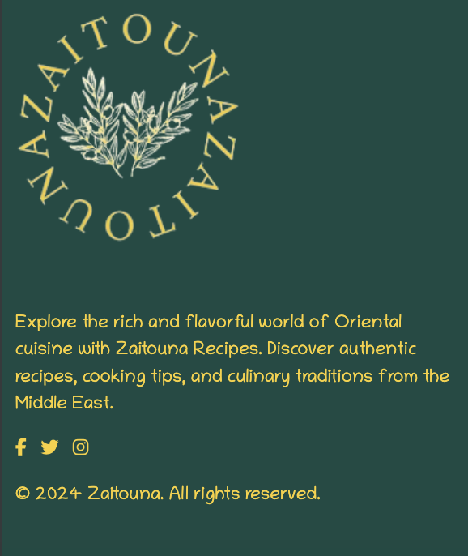

# Zaitouna


## Introduction

Zaitouna is a recipe Website and the name "Zaitouna" means olive in Arabic, symbolizing health and flavor, invoking the essence of olive and the rich flavors it represents in Arabic cuisine. Zaitouna has been developed as part of the Code Institute's Full-Stack Developer course as my 4th project - focusing on Django and Bootstrap frameworks, Database manipulation and CRUD functionality. 


View the live site here : [Zaitouna](https://zaitouna-rano-19b1e34433ec.herokuapp.com/)  
  
For Admin access with relevant sign-in information: [Zaitouna Admin](https://zaitouna-rano-19b1e34433ec.herokuapp.com/admin/)  

<hr>

## Table of Contents

- [Zaitouna](#Zaitouna)
  - [Introduction](#introduction)
  - [Table of Contents](#table-of-contents)
  - [Overview](#overview)
- [UX - User Experience](#ux---user-experience)
  - [Wireframes](#Wireframes)
  - [Site Structure](#site-structure)
  - [Design Inspiration](#design-inspiration)
    - [Colour Scheme](#colour-scheme)
    - [Font](#font)
- [Project Planning](#project-planning)
  - [Strategy Plane](#strategy-plane)
    - [Site Goals](#site-goals)
  - [Agile Methodologies - Project Management](#agile-methodologies---project-management)
    - [MoSCoW Prioritization](#moscow-prioritization)
    - [Sprints](#sprints)
  - [User Stories](#user-stories)
    - [Visitor User Stories](#visitor-user-stories)
    - [Epic - User Profile](#epic---user-profile)
    - [Epic - Articles](#epic---articles)
    - [Epic - Booking](#epic---booking)
    - [Epic - Photo Gallery](#epic---photo-gallery)
    - [Epic - Visit Us/Reviews](#epic---visit-usreviews)
  - [Scope Plane](#scope-plane)
  - [Structural Plane](#structural-plane)
  - [Skeleton \& Surface Planes](#skeleton--surface-planes)
    - [Wireframes](#wireframes)
    - [Database Schema - Entity Relationship Diagram](#database-schema---entity-relationship-diagram)
    - [Security](#security)
- [Features](#features)
  - [User View - Registered/Unregistered](#user-view---registeredunregistered)
  - [CRUD Functionality](#crud-functionality)
  - [Feature Showcase](#feature-showcase)
  - [Future Features](#future-features)
- [Technologies \& Languages Used](#technologies--languages-used)
  - [Libraries \& Frameworks](#libraries--frameworks)
  - [Tools \& Programs](#tools--programs)
- [Testing](#testing)
- [Deployment](#deployment)
  - [Connecting to GitHub](#connecting-to-github)
  - [Django Project Setup](#django-project-setup)
  - [Cloudinary API](#cloudinary-api)
  - [Elephant SQL](#elephant-sql)
  - [Heroku deployment](#heroku-deployment)
  - [Clone project](#clone-project)
  - [Fork Project](#fork-project)
- [Credits](#credits)
  - [Code](#code)
  - [Media](#media)
    - [Additional reading/tutorials/books/blogs](#additional-readingtutorialsbooksblogs)
  - [Acknowledgements](#acknowledgements)


## Overview

Zaitouna is a recipe Website that represents Arabic cuisine. Users are invited to:

- Join the Zaitouna Website
- Create their own profiles
- Update their Profiles 
- Interact with Website recipes
- Create and manage their recipes
- Share their thoughts as Comments 
- Save the recipe for later reach as a bookmark
- Share the recipe over social media accounts

Zaitouna is accessible via all browsers with full responsiveness on different screen sizes. The objective of the project is to develop a comprehensive recipe website where users can discover, save, and share recipes. The website aims to provide a user-friendly platform for individuals interested in cooking to find a wide range of recipes and cooking difficulty levels. Additionally, the website will facilitate interaction and engagement among users through features such as commenting, rating, and sharing recipes.


# UX - User Experience


## Wireframes

Wireframes were created using [Balsamiq](https://balsamiq.com/) to plan content flow and styling for Zaitouna. Some differences can be seen between the original wireframes and the finished product, and this is due to design choices made during the creative process.

### Home Page 


### Recipe Details


### Search Recipes


### Add Recipes


## Site Structure 

The website is organized into several main sections to provide users with a seamless browsing experience. Upon landing on the homepage, users are greeted with a selection of Weekly recipes and featured recipes, showcasing the newest popular dishes. They can also explore various recipe meal types, including appetizers, main courses, desserts, and beverages, to find recipes that suit their preferences. A search bar is available for users to quickly find specific recipes or ingredients.

Registered users have access to their own user profile, where they can upload a profile picture, write a bio, and view the recipes they have added to the website. Each recipe has its own detailed page, displaying the title, ingredients, instructions, reviews, ratings, and options to share the recipe with others.

For new users or those who need to log in, the website provides authentication pages for logging in and signing up. In case users encounter a page that does not exist or encounter a broken link, a custom 404 error page is available to guide them back to the main site.

Finally, the footer of the website contains essential info about the website, and links to the website's social media profiles, allowing users to stay connected and informed about the latest updates and news related to Zaitouna Recipes.


## Design Inspiration

The design inspiration behind the Zaitouna website is rooted in creating a visually appealing and comfortable user experience. With a focus on olives, symbolized by the name "Zaitouna" which means olives in Arabic, the design aims to evoke a sense of freshness, tranquility, and authenticity.

The choice of a white background contributes to a clean and minimalist aesthetic, providing a canvas for the vibrant green color scheme to shine. Green, reminiscent of olive leaves, is prominently featured throughout the website to reinforce the connection to nature and the Mediterranean region.

The logo, with its depiction of olive leaves, serves as a visual representation of the website's name and theme. By incorporating elements from nature, the logo reinforces the concept of freshness and natural ingredients.

<br>


### Colour Scheme

Colors have been selected carefully in a way that reflects the essence of olives.
**Primary Color (Header/Footer): #184B44**
This deep green shade represents the rich color of olives, tying in with the Mediterranean theme of the website.

**Accent Color: #FAD02E**
Our warm yellow accent color symbolizes the transformation of olives into delicious meals, mirroring the process from raw material to culinary delight.

**Secondary Accent Colors:**
#7DCE82: A refreshing mint green shade, perfect for buttons and interactive elements.

**Neutral Color**
#FFFFFF: Pure white is used to ensure readability and contrast against the other dark elements.


  

### Font

Using [Google Fonts](https://fonts.google.com/), two fonts was opted: 

**Chilanka:**

Chilanka font was opted for the text throughout the website. Its handwritten style evokes a sense of familiarity and nostalgia, reminiscent of jotting down recipes on paper. This choice aims to create a personal connection with users, inviting them to share their culinary creations as if they were writing them by hand.

**Montserrat:**

Montserrat is used for titles and headings, adding a touch of elegance and modernity to the website's design. Its clean and geometric appearance complements the handwritten style of Chilanka, creating a balanced and harmonious typographic palette.

In development, 'Chilanka' was identified by variable ``` --main-font```, whilst 'Montserrat' was set as ``` --title``` within the CSS file. Similar to my setup for the project's colors, using variables helped to speed up the front-end process.

  
  


# Project Planning  
 
## Strategy Plane

The focus of the website is on creating a user-centric platform that celebrates the rich culinary heritage of Oriental cuisine. Our key objectives include:

1- User Engagement: Prioritizing features that enhance user interaction and encourage community participation, such as recipe sharing, commenting, and rating.

2- Authenticity: Curating a diverse collection of authentic recipes from the Middle East, Asia, and beyond, ensuring a genuine culinary experience for our users.

3- Visual Identity: Establishing a distinctive visual identity through carefully selected colors, fonts, and imagery that reflect the essence of olives and Mediterranean cuisine.

4- Accessibility: Designing a user-friendly interface that is accessible to all users, regardless of their device or abilities, to ensure an inclusive experience for everyone.

5- Scalability: Building a robust and scalable platform capable of accommodating future growth and expansion, including the addition of new features and functionalities.

### Site Goals

1- Discover Recipes: Users want to find new and interesting recipes to try out.

2- Save and Organize Recipes: Users want to save their favorite recipes and organize them for easy access.

3- Interact with Community: Users want to engage with other users by sharing their experiences, leaving comments, and rating recipes.

4- Contribute Content: Users want to contribute their own recipes to the website and share them with others.

5- Learn and Improve Cooking Skills: Users want to learn new cooking techniques, discover tips, and improve their culinary skills through the content provided on the website.

## Agile Methodologies - Project Management

Zaitouna is my first project following Agile planning methods. I used my [Github Projects Board](https://github.com/users/raneem-yad/projects/4) to plan and document all of my work.

### MoSCoW Prioritization

I chose to follow the MoSCoW Prioritization method for Zaitouna, identifying and labeling:

- **Must Haves**: the 'required', critical components of the project. Completing my 'Must Haves' helped me to reach the MVP (Minimum Viable Product) for this project early, allowing me to develop the project further than originally planned.
  
- **Should Haves**: the components that are valuable to the project but not absolutely 'vital' at the MVP stage. The 'Must Haves' must receive priority over the 'Should Haves'.
- **Could Haves**: these are the features that are a 'bonus' to the project, it would be nice to have them in this phase, but only if the most important issues have been completed first and time allows.
- **Won't Haves**: the features or components that either no longer fit the project's brief or are of very low priority for this release. 

### Sprints

With a tight deadline of 10 days to complete the project, I organized my work into four sprints. This rapid sprint approach allowed me to break down the project into manageable chunks and maintain focus on delivering key features and functionality.

During each sprint, I divided my tasks into two main categories: Developer (Dev) Tasks and User Stories. These tasks were converted into issues and meticulously labeled on my project board. Every issue was tagged as either a user story or a bug, providing clear reference points for development tasks.

Each user story was carefully crafted to include detailed information about its theme, epic, acceptance criteria, and associated tasks. This structured approach helped me stay organized and prioritize my work effectively.

Furthermore, breaking down user stories into individual tasks enabled me to track progress and easily identify the next steps in the development process. This agile methodology proved invaluable in maximizing productivity and ensuring the timely completion of project milestones.


| Sprint No. | Sprint Content | Start/Finish Dates |
|------------|----------------|--------------------|
| #1 | Setup/Recipe Features | 08/04/24  -> 11/04/24  |
| #2 | Comments/ Sharing | 11/04/24  -> 13/04/24  |
| #3 | Rating/ Profiles | 13/04/24 -> 15/04/24 |
| #4 | Testing/Documentation | 15/04/24 -> 17/04/24 |


## User Stories

User stories and features recorded and managed on [GitHub Projects](<https://github.com/users/raneem-yad/projects/4>)


### Database Schema

Database schemas were drawn up using [App Diagrams.net](https://app.diagrams.net/). The schemas were used to plan the database models and fields. It also helped in displaying the relationships between the models and how they interact. Zaitouna consists of five models - Recipe, Comment, User, Meal-type and Rating.
There were some changes between the designed database and the implemented one due to more clarity like Category Table was changed to Meal-Type


## Scope Plane

In the scope plane of the Zaitouna Recipes project, the boundaries and features were defined that will be included in the website. The scope encompasses the key functionalities and components that will be developed to meet the project objectives.

The scope has been defined to prioritize essential features that align with the project objectives and timeline. By focusing on core functionalities such as user authentication, recipe management, and profile enhancement, a solid foundation was ensured for the website while keeping development efforts manageable within the specified timeframe.


Features Included:

1- User Authentication: Allow users to create accounts, log in, and manage their profiles.
2- Recipe Management: Enable users to add, edit, and delete their recipes.
3- Recipe Browsing: Provide users with the ability to browse and search for recipes based on meal type and keywords.
4- Recipe Interaction: Allow users to  rate, review(comment), and share recipes with others.
5- Profile Enhancement: Allow users to personalize their profiles by uploading profile pictures and adding a bio.
6- Home Page Features: Showcase featured recipes(weekly recipes) and provide quick access to the latest recipes.
7- Layout and Design: Responsive website for users of mobile, tablet and desktop devices

# Features

## Existing Features

### Homepage

The homepage is the first page of the site that a user will see when they navigate to the [Zaitouna URL](https://zaitouna-rano-19b1e34433ec.herokuapp.com/). It's designed to be eye-catching to users and to quickly summarise the intention of the site. It is also a central location for all users to view recipes. 


#### Navigation

Site navigation is present at all times on every page of the site in the form of footer and header nav bars. These navigational elements change depending on whether a user is logged in or not. Non logged in users only have access to the home page, recipe detail pages, view all recipe page and the login and signup page. These elements are also fully responsive and the header collapses to become a mobile menu on small screen sizes. The header nav features the site logo which is also a link back to the home page. It also features a post a recipe button which is distinctly different from the other nav menu items. This is to draw the user's eye and encourage them to sign up so that they can use this feature. All nav menu items feature a scale and underline hover effect. Navigation items are active on the current page and the  white color as indicator as a visual aid to show the user where they are.


#### Hero

The homepage hero section is the large eye-catching section that is just beneath the navigation bar. The hero is only displayed on the homepage as Weekly Recipe. It is used to catch the users attention, and to clearly showcase the general topic of the site. It features a large image for the recipe week and with title and description about the recipe and call to action button to help user see the full image details.


#### Latest Recipes List

The latest recipe list is a dynamic list of the latest recipes that have been uploaded to the site. When a new recipe is published it will appear at the top of the list. Each recipe is displayed as a card, and each card has an image, , title, author profile image  and author name, posted date , tags of difficulty , meal type, serves and cooking time, small description and in the card footer a rating of 5 stars and a button to the full recipe page. The list displays a maximum of six cards to avoid clutter. At the end of the section, there is also a buttons to go to the next recipe page. This section is fully responsive, and cards stack on top of each other on smaller screens. 


#### Footer

The Zaitouna footer is present on every page of the site. It features the website logo, elegantly designed with olive leaves to symbolize the essence of Zaitouna. beside the logo, users can find a concise website description, capturing the essence of Zaitouna Recipes as a platform celebrating the rich culinary heritage of Oriental cuisine. Social media icon links feature coloured hover effects. 





### Authorization

#### Sign Up

A user can navigate to the sign up page via the site navigation bars if they are not logged in. The Zaitouna sign up page is a template from the [Django Allauth Package](https://django-allauth.readthedocs.io/en/latest/installation.html). Allauth provides the basic functionality for the user authorization used in Zaitouna. However, the basic allauth templates have been heavily customized and styled to match the site design. The sign up page features a title and a sign up form with user input fields. Once a user submits the form correctly they are redirected back to the homepage as a logged-in user.


#### Log In

A user can navigate to the log in page via the site navigation bars if they are not already logged in. The styling of the log in page is very similar to the rest of the user authorization pages. The color scheme and background image are consistent, but the form and page heading are different. Once the log in form is submitted correctly the user is redirected to the homepage as a logged-in user.


#### Log Out

A user can navigate to the log-out page via the site navigation bars if they are logged in. They are prompted on this page to confirm they wish to log out. Upon confirmation, the user is logged out and redirected to the homepage. The styling is consistent with the other authorization pages for coherence. 


### Full Recipe Details

The full recipe details page is a template used to display the full information of a recipe. Each published recipe has a recipe details page. Theses pages are available for all users to view, including non-logged-in users. The main purpose of the page is to display the full recipe instructions and ingredients. Users will generally navigate to a full recipe page by clicking the button on the recipe card either on the home page or the all recipes page. As the user has now shown a specific interest in the recipe, all the information about the recipe is displayed here. 


#### Recipe Details

The first section of the recipe page features the recipe image. When there is more than one image, a gallery of images is displayed underneath the main image. Basic recipe details and information is displayed in the top section, such as cooking, prep time and allergens. There is also an icon on the image which allows the user to like the recipe. In the middle section there are two columns of text displaying the recipe ingredients and method. These fields are both summernote fields so they accept fully formatted and styled user text. Each section on the recipe details page is separated by a divider to clearly illustrate the different segments. 


#### Bookmark / Unbookmark Recipe

The bookmark feature on the Zaitouna Recipes website allows users to save recipes for easy access and future reference. When users find a recipe they want to save, they can simply click on the bookmark icon associated with that recipe. This action adds the recipe to their list of bookmarked recipes, which they can access later from their profile page.

Conversely, users can also unbookmark a recipe if they no longer wish to save it. By clicking on the bookmark icon again, the recipe is removed from their list of bookmarked recipes.

This bookmarking functionality enhances the user experience by providing a convenient way for users to keep track of their favorite recipes and quickly access them whenever they need. Whether they're planning their next meal or revisiting a beloved dish, the bookmark feature ensures that users can easily find the recipes that matter most to them.


#### Share Recipe

The share feature on the Zaitouna Recipes website allows users to easily share their favorite recipes with friends, family, and followers on social media platforms such as Facebook and Twitter, as well as through email.

When users come across a recipe they want to share, they can simply click on the share icon associated with that recipe. This action opens a popup or modal window with options to share the recipe on various social media platforms, including Facebook and Twitter. Users can also choose to share the recipe via email by entering the recipient's email address and adding a personalized message.

By leveraging the share feature, users can spread the joy of cooking and inspire others with delicious recipes from Zaitouna Recipes. Whether they're sharing a newfound favorite or recommending a dish to a friend, the share feature facilitates seamless sharing and engagement across social networks and personal contacts.


#### Rating Recipe

The rating feature on the Zaitouna Recipes website allows users to rate recipes based on their experience, with a scale of five stars representing the overall quality and appeal of the recipe. Users can provide their rating by clicking on the appropriate number of stars, ranging from one star for the lowest rating to five stars for the highest rating.

In addition to individual ratings, the website also displays the average rating for each recipe, calculated based on the collective ratings provided by all users. beside the average rate there is a number of people who have rated the recipe, providing users with an indication of the recipe's popularity and the reliability of the average rating. This information helps users make informed decisions about which recipes to try and enables them to gauge the general consensus among other users.

By incorporating the rating feature alongside with the number of ratings, Zaitouna Recipes empowers users to share their feedback, discover top-rated recipes, and contribute to a vibrant and engaged community of culinary enthusiasts.


#### Recipe Comments

At the top of each recipe there is a comment icon with the count of comments on the recipe.

At the bottom of each recipe details page there is a comments section for users to post comments. Logged in users can use the comment form to post a comment to that particular recipe. Comments need to be approved by an admin before they appear on the site. Comments are listed in the admin area as unapproved, and there is an action to approve comments in the admin actions menu. When comments are approved by the admin they immediately go live on the site and appear beneath the recipe. Comments are listed from the most recent at the top to the oldest at the bottom. The username of the comment author is displayed as well as the date and  profile photo and the body of the comment. 


#### Comment Form

The recipe comment form is what the user uses to post a comment on a recipe. This comment form is only visible to logged in users, as a username is required for successful submission. The comment form comprises of one text body field for the comment and a submit button. The author is assigned automatically as well as the created-on date.


#### Post Comment Notification

Upon the successful submission of the comment form, the page will refresh and a notification will appear at the top of the page. This notification advises the user that their comment has been successfully posted. The notification can be removed from view by clicking the x icon The form is also hidden from view in the comment section, and this is instead replaced by a short paragraph of text thanking the user for posting a comment. The text also advises the user that the comment will be visible after it has been approved. 


### Search Recipes

The search functionality on the Zaitouna Recipes website allows users to easily find recipes by entering keywords related to discriptions or recipe names. Users can simply type their desired keywords into the search bar and press 'Search' to view relevant recipes matching their search criteria.

In addition to keyword search, the website also provides the option to filter recipes by meal type, allowing users to narrow down their search results based on specific categories such as breakfast, lunch, dinner, appetizers, desserts, and more. Users can select their desired meal type from a dropdown menu or a list of predefined categories to refine their search results further.

By combining keyword search with meal type filtering, Zaitouna Recipes offers users a comprehensive and customizable search experience, enabling them to find exactly what they're looking for quickly and efficiently. Whether users are searching for a specific recipe or exploring new meal ideas, the search functionality provides a convenient and user-friendly way to discover delicious recipes tailored to their preferences.


#### Profiles

The profile page on the Zaitouna Recipes website serves as a personalized hub for each user, allowing them to manage their account, showcase their contributions, and connect with other members of the community. Here's an overview of the key features and components of the profile page:

1- Profile Picture and Username: The top section of the profile page displays the user's profile picture, providing a visual representation of their identity on the website. Next to the profile picture, the user's username is prominently displayed, allowing other users to easily identify and connect with them.

2- Bio: Besides the profile picture and username, users have the option to write a bio to share more about themselves with the community. This section allows users to express their interests, culinary preferences, and any other information they wish to share.

3- User Contributions: The profile page showcases the user's contributions to the website, including the recipes they have added. Users can browse through their recipes and see how they have contributed to the community.

4- Edit Profile: Users can edit their profile information directly from the profile page. This includes updating their profile picture and editing their bio.

5- Bookmarked Recipes: This page is also displaying the recipes they have bookmarked for future reference. This allows users to easily access their favorite recipes from their profile page.


#### Delete / Edit Recipe

A user can delete their recipe easily from the My Recipe page. If a user clicks the delete button on a recipe card the card content is hidden and a delete confirmation is displayed seeking confirmation from the user for recipe deletion. The user is also warned that the process cannot be undone. The user then has the option to cancel the delete by clicking the cancel button or to confirm recipe deletion by clicking the delete button. The delete button is purposefully coloured red for warning. If the user clicks the cancel button the card content is returned to normal. If the user clicks the delete button the recipe is deleted from the database and the page is refreshed showing the recipe removed from the list.


### Post A Recipe

The post a recipe page template is a page which features a recipe form to enable users to submit a recipe to the Zaitouna site. The page isn't viewable by unauthenticated users so they have to login first. The page features similar styling to the rest of the site for consistency, and the header and footer nav menus are present for easy user navigation. 


### 404 Page

The 404 page is triggered when a user navigates to a site URL which doesn't exist. This could be because of a number of reasons, including a faulty link or an expired URL. Most users will not see this page, but it is there as a backup for users who encounter these rare errors. The purpose of the 404 page is to notify the user that there has been an error, and the page that they have tried to access cannot be found. The Zaitouna 404 page provides a button link to the homepage for the user to easily navigate back home.


## Future Features

I believe the Zaitouna site has a lot of potential for expansion in the future. The basic functionality is there for the MVP, but there are many features I would like to add in the future.


### User Change Password

Adding this option for users who forget or want to change their password. Currently, a user has no way to retrieve their password/profile if they forget their login details. This could result in the user losing access to their profile and recipes. This is a big problem and could lead to users abandoning the site in the future. Hence this feature is a priority moving forward.


### Sign Up Email Confirmation

Another future feature I would like to implement relating to authorization is a user sign-up email confirmation. I would like a user sign-up form submission to trigger an automated email into the user inbox prompting them to confirm their email address. This would help to prevent spam profiles. Users who sign up but don't confirm their email can still view the site but have limited access to site functionality such as posting and commenting.


### Advanced Search Recipes

Expand the search functionality to include more advanced filters, such as dietary preferences (e.g., vegetarian, vegan, gluten-free), cooking time, difficulty level, and ingredient exclusions. This would allow users to find recipes that better match their specific needs and preferences.

### Interactive Cooking Guides

Introduce interactive cooking guides or step-by-step tutorials for select recipes, complete with instructional videos, tips, and techniques to help users master the cooking process and achieve professional results.

### Meal Planning Tools

Integrate meal planning tools that enable users to plan their meals for the week, generate shopping lists based on selected recipes, and track their cooking progress.

### Localization Support

Offer support for multiple languages and regional cuisines to cater to a diverse audience of users from different cultural backgrounds and geographic regions.

# Technologies Used

## Languages

* [HTML5](https://developer.mozilla.org/en-US/docs/Web/HTML) - Provides the basic content and structure for the site.
* [CSS3](https://developer.mozilla.org/en-US/docs/Web/CSS) - Provides the styling for the site.
* [Python](https://www.python.org/) - Provides the functionality for the site.
* [JavaScript](https://www.javascript.com/) - Provides interactivity and front-end functionality for the site.
* [Git](https://git-scm.com/) - Provides the version control system for the site.

## Frameworks

* [Bootstrap](https://getbootstrap.com/) - A front-end framework for rapidly building websites.
* [Django](https://www.djangoproject.com/) - A high-level Python web framework.


## Software

* [Balsamiq](https://balsamiq.com/) - An online cloud-based software used for creating the site wireframes.
* [GitHub](https://github.com/) - An internet hosting service used for version control. Used to host the Zaitouna repository and for the project board used for project management and user stories.
* [Pycharm](https://www.jetbrains.com/pycharm/) - The Python IDE for data science and web development.
* [Heroku](https://dashboard.heroku.com/) - A cloud platform used to host the Zaitouna full-stack application.
* [CI Database Maker](https://dbs.ci-dbs.net/manage/rTakZeqXDXBar2aq/) - A free PostgreSQL database system supported by code institute used for the application database.
* [Cloudinary](https://cloudinary.com/?&utm_campaign=1329&utm_content=instapagelogocta-selfservetest) - A cloud-based video and image management platform used to store the site images.
* [Slack](https://slack.com/intl/en-gb/) - An online instant messaging program used for site feedback and guidance from the [Code Institute](https://codeinstitute.net/) community.
* [App Diagrams](https://app.diagrams.net/) - An online diagram software used for the database schemas.
* [Google Chrome Dev Tools](https://developer.chrome.com/docs/devtools/) - A set of web developer tools built directly into the chrome browser. Used for responsiveness tests and further testing.
* [Google Fonts](https://fonts.google.com/) - A web based font service by Google used to supply the site typography.
* [Lighthouse](https://developer.chrome.com/docs/lighthouse/overview/) - An open source automated testing tool used for site tests.
* [Responsive Design Checker](https://responsivedesignchecker.com/) - An online testing tool used for responsive site testing.
* [Am I Responsive](https://ui.dev/amiresponsive) - An online testing tool used for responsive site testing.
* [Wave Web Accessibility Evaluation Tool](https://wave.webaim.org/) - An online suite of evaluation tools use to test the site for accessibility.


## Libraries

This is a list of the Python / Django libraries used in this project.

* [asgiref](https://github.com/django/asgiref) - A standard Python library to allows for asynchronous web apps and servers to communicate with each other. 
* [binaryornot](https://pypi.org/project/binaryornot/) - An ultra-lightweight Python package to guess whether a file is binary or text.
* [chardet](https://pypi.org/project/chardet/) - A universal encoding detector for Python3.
* [click](https://click.palletsprojects.com/en/8.1.x/) - A Python package for creating beautiful command line interfaces in a composable way with as little code as possible.
* [cloudinary](https://pypi.org/project/cloudinary/) - A Python package allowing integration between the application and Cloudinary. 
* [cookiecutter](https://cookiecutter.readthedocs.io/en/stable/) - A Python package used to create projects from project templates.
* [dj-database-url](https://pypi.org/project/dj-database-url/) - A Django utility to utilise the DATABASE_URL environment variable to configure the Django application. Used with PostgreSQL.
* [dj3-cloudinary-storage](https://pypi.org/project/dj3-cloudinary-storage/) - A Django package that facilitates integration with Cloudinary storage.
* [Django](https://www.djangoproject.com/) - A python package for the Django framework.
* [django-active-link](https://pypi.org/project/django-active-link/) - A Django package used to highlight an active link in the site navigation bars.
* [django-allauth](https://django-allauth.readthedocs.io/en/latest/) - An integrated set of Django applications addressing user authentication, registration and account management.
* [django-browser-reload](https://github.com/adamchainz/django-browser-reload) - A Django package to automatically refresh the browser during development.
* [django-crispy-forms](https://django-crispy-forms.readthedocs.io/en/latest/) - A Django package that provides tags and filters to control the rendering behaviour of Django forms.
* [django-summernote](https://pypi.org/project/django-summernote/) - A Django package to allow for the embedding of the summernote text editor into Django.
* [django-tailwind](https://django-tailwind.readthedocs.io/en/latest/installation.html) - A Django package to allow for the easy integration of the Tailwind CSS utility framework with Django.
* [gunicorn](https://gunicorn.org/) - A Python WSGI HTTP Server for UNIX.
* [jinja2-time](https://pypi.org/project/jinja2-time/) - A Jinja2 Python extension for dates and times.
* [oauthlib](https://github.com/oauthlib/oauthlib) - A generic, spec-compliant, thorough implementation of the OAuth request-signing logic for Python 3.6+.
* [psycopg2](https://pypi.org/project/psycopg2/) - A PostgreSQL database adapter for Python.
* [PyJWT](https://pyjwt.readthedocs.io/en/latest/) - A Python library that allows for encoding and decoding of JSON Web Tokens (JWT).
* [python-slugify](https://pypi.org/project/python-slugify/) - A Python application that generates slug fields from unicode strings.
* [python3-openid](https://pypi.org/project/python3-openid/) - A set of Python packages to support use of the OpenID decentralized identity system.
* [pytz](https://pypi.org/project/pytz/) - A Python package for world timezone definitions, modern and historical.
* [requests-oauthlib](https://pypi.org/project/requests-oauthlib/) - A Python package for OAuthlib authentication support for Requests.
* [sqlparse](https://pypi.org/project/sqlparse/) - A non-validating SQL parser for Python.
* [text-unidecode](https://pypi.org/project/text-unidecode/) - The most basic Text::Unidecode port for Python.

